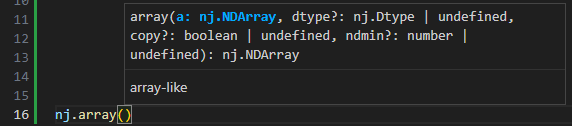

# nj
np in js

## Installation
via npm
```sh
npm i @irreg/nj
```
[Minified bundle file](./dist/bundle.min.cjs) for browser use

## Get started
Once installed, you can use it in both ES6 module and CommonJS formats or in browser.

**ES6 module (recommended)**
```javascript
import * as nj from '@irreg/nj';
```

**CommonJS**
```javascript
const nj = require('@irreg/nj');
```

**In browser**
```html
<script src="./bundle.min.cjs"></script>
<script>
    console.log(nj.arange(10));
</script>
```

## API
**Indexing**
```javascript
let a = nj.arange(10).at(nj.slice(5));
console.log(a); // array([5, 6, 7, 8, 9])
a = nj.arange(10).at(nj.slice(5, 0, -1));
console.log(a); // array([5, 4, 3, 2, 1])
a = nj.arange(10).at(':5').at('::-1');
console.log(a); // array([4, 3, 2, 1, 0])
a = nj.arange(10).at(nj.slice(5), null);
console.log(a); // array([[5], [6], [7], [8], [9]])
```
**Basic Indexing and view**
```javascript
let a = nj.arange(9).reshape(-1, 3);
let b = a.at(':', 0);
console.log(b); // array([0, 3, 6])
b.fill(-1);
console.log(b); // array([-1, -1, -1])
console.log(a); // array([[-1, 1, 2], [-1, 4, 5], [-1, 7, 8]])
```

**Advanced indexing and set**
```javascript
let a = nj.arange(9).reshape(-1, 3);
let mask = nj.greater(a, 5);
console.log(mask); // array([[false, false, false], [false, false, false], [true, true, true]])
let b = a.at(mask);
console.log(b); // array([6, 7, 8])
a.set([mask], -1);
console.log(a); // array([[0, 1, 2], [3, 4, 5], [-1, -1, -1]])
```

**Broadcasting**
```javascript
let a = nj.arange(9).reshape(-1, 3);
a = nj.add(a, [1, 2, 3]);
console.log(a); // array([[1, 3, 5], [4, 6, 8], [7, 9, 11]]
```

**Numerics**
```javascript
let a = nj.array([
	[1, 2, 3],
	[4, 5, 6],
]);
console.log(nj.cumsum(a)); // array([1, 3, 6, 10, 15, 21])
```
```javascript
console.log(nj.sum([[0, 1], [0, 5]], 0)); // array([0, 6])
console.log(nj.sum([[0, 1], [0, 5]], 1)); // array([1, 5])
```

**Flatten**
```javascript
let a = nj.arange(9).reshape(-1, 3);
a.set([[0, -1], 1], -1);
console.log(a.flatten()); // array([0, -1, 2, 3, 4, 5, 6, -1, 8])
```

It does most of what you expected with numpy.

## Documentation
To find more documentation on the APIs, you can visit  [https://zgtcktom.github.io/nj/](https://zgtcktom.github.io/nj/) (generated by jsdoc).

Both jsdoc comments and `.d.mts` typescript declaration files are available. Recommend using VSCode for code editing.


## Build from git
```sh
git clone https://github.com/zgtcktom/nj.git
npm install
npm run build
```